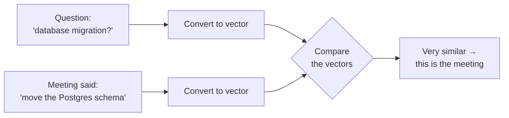
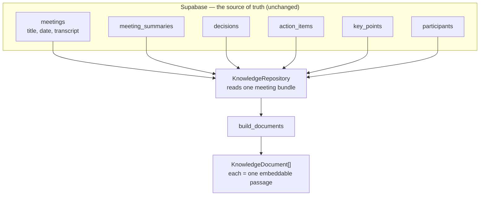
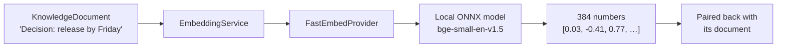
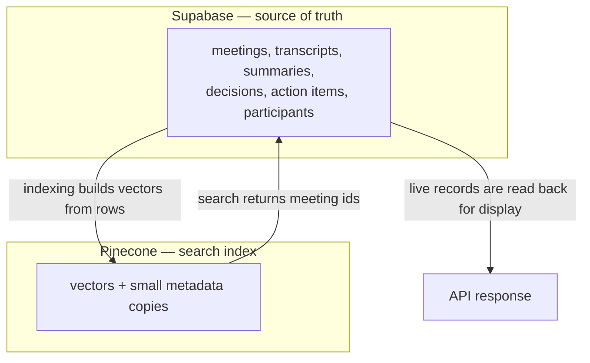
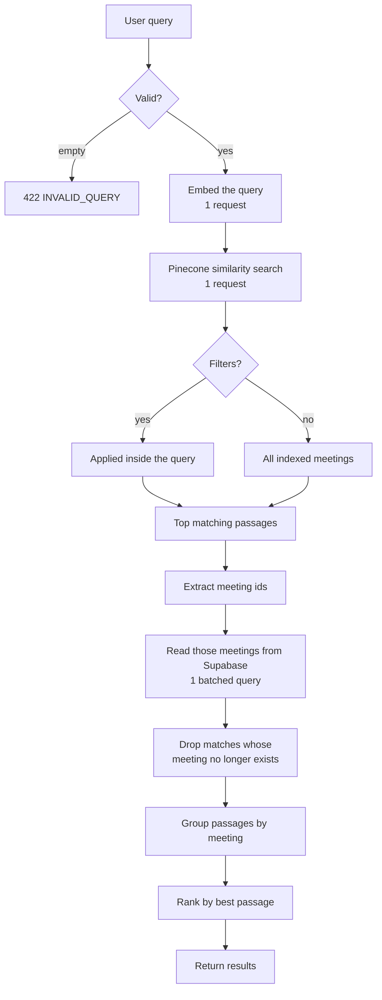
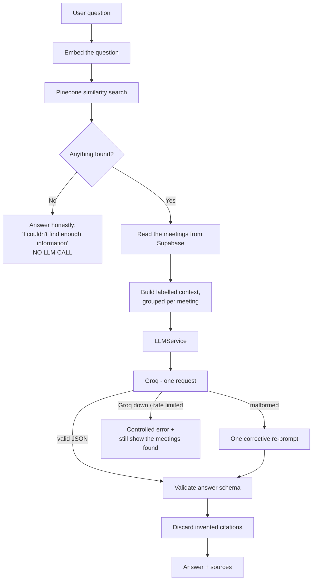
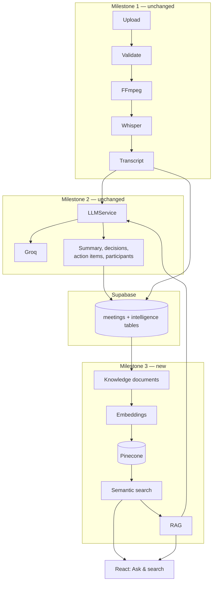

# Milestone 3 — Meeting Knowledge Repository, Semantic Search and RAG

> Written to be read by someone who has never used a vector database. Every term
> is explained the first time it appears.

> **Update:** the application now uses **Groq as its only LLM** (Grok/xAI and
> Google Gemini were removed), and embeddings are computed by a **free local
> model** (`BAAI/bge-small-en-v1.5`, 384 dimensions) instead of Gemini. This
> document reflects that. The full account of the change - and why - is in
> [`MILESTONE_3_GROQ_ONLY.md`](MILESTONE_3_GROQ_ONLY.md).

---

## Table of contents

1. [What Milestone 3 adds](#1-what-milestone-3-adds)
2. [Why vector search is required](#2-why-vector-search-is-required)
3. [The Meeting Knowledge Repository](#3-the-meeting-knowledge-repository)
4. [Embeddings](#4-embeddings)
5. [Pinecone, the vector database](#5-pinecone-the-vector-database)
6. [Semantic search](#6-semantic-search)
7. [RAG — grounded question answering](#7-rag--grounded-question-answering)
8. [How it fits the existing project](#8-how-it-fits-the-existing-project)
9. [Code structure](#9-code-structure)
10. [API endpoints](#10-api-endpoints)
11. [Environment variables](#11-environment-variables)
12. [Database migration](#12-database-migration)
13. [API quota discipline](#13-api-quota-discipline)
14. [Error handling](#14-error-handling)
15. [Testing](#15-testing)
16. [How I would explain Milestone 3 to my mentor](#16-how-i-would-explain-milestone-3-to-my-mentor)

---

## 1. What Milestone 3 adds

Milestones 1 and 2 process meetings **one at a time**:

```text
Milestone 1   recording -> FFmpeg -> Whisper -> transcript
Milestone 2   transcript -> Groq -> summary, decisions, action items
```

That is excellent for the meeting you just uploaded — and useless for the
question *"what did we decide about the mobile app three weeks ago?"*. To answer
that today you would open meetings one by one and read them.

Milestone 3 turns the whole **history** into something you can question:

```text
Milestone 3   all past meetings -> knowledge repository -> embeddings
              -> vector database -> semantic search -> grounded AI answers
```

Two new abilities, both on one new page (**Ask & search**):

| Ability | Example | What happens |
| --- | --- | --- |
| **Semantic search** | *"Which meeting discussed the database migration?"* | Returns the matching meetings. No AI text generation. |
| **RAG question answering** | *"What deadline was decided for the mobile application?"* | Returns a written answer **plus the meetings it came from**. |

Nothing from Milestones 1 and 2 changed. Upload, FFmpeg, Whisper, transcripts,
downloads, accuracy testing, the Groq meeting analysis and every
existing screen work exactly as before.

---

## 2. Why vector search is required

### Ordinary database search matches letters

`SELECT * FROM meetings WHERE transcript_text LIKE '%database migration%'`

This finds the meeting **only if those exact words were spoken**. But people
don't speak in keywords:

| You search for | The meeting actually said | Keyword search |
| --- | --- | --- |
| "database migration" | "we need to move the Postgres schema over" | ❌ finds nothing |
| "who is late?" | "Ravi's API work has slipped past Friday" | ❌ finds nothing |
| "budget" | "we can't afford another contractor" | ❌ finds nothing |

The information is there. The *letters* are not.

### Semantic search matches meaning

Semantic search converts text into a list of numbers — a **vector** — that
represents what the text *means*. Texts with similar meanings get similar
numbers, even with no words in common:

```text
"database migration"              ->  [0.81, 0.12, 0.55, ...]
"moving the Postgres schema"      ->  [0.79, 0.15, 0.51, ...]   <- very close
"the office coffee machine"       ->  [0.02, 0.91, 0.07, ...]   <- far away
```

"Close" is measured with **cosine similarity** — the angle between two vectors.
A score near `1.0` means nearly the same meaning; near `0` means unrelated.

So the pipeline becomes: *turn the question into a vector → find the closest
meeting passages → those are your answers.*



---

## 3. The Meeting Knowledge Repository

### What it is

The repository is **not a new database**. Supabase already holds everything;
Milestone 3 simply reads those rows and reshapes them into passages worth
searching.



`KnowledgeRepository` deliberately **reuses** `MeetingRepository` and
`IntelligenceRepository` instead of writing new queries — those already work, so
re-querying the same tables would just be a second implementation to keep in
sync.

### What becomes searchable

| Source type | One document per… | Example text that gets embedded |
| --- | --- | --- |
| `transcript` | ~1,200-character passage | *"Ravi opened the meeting about the mobile application launch…"* |
| `summary` | meeting | *"Summary of the meeting 'Mobile Application Planning': …"* |
| `decision` | decision row | *"Decision made in the meeting: release the app by Friday."* |
| `action_item` | task row | *"Action item: Run UI testing. Assigned to: Priya. Deadline: Friday. Priority: high. Status: pending."* |
| `key_point` | key point row | *"Key point discussed in the meeting: the launch is on track."* |
| `participants` | meeting (one roster) | *"Participants in the meeting 'X': Ravi (Backend), Priya (QA)."* |

**Where are deadlines?** Inside action items — in the text *and* in the
metadata (`deadline`, `has_deadline`). They deliberately get no vector of their
own: that would be a near-copy of the action item and would spend embedding
quota twice for the same sentence.

### Every document is traceable

Requirement: no orphan knowledge. Every document carries a deterministic id:

```text
{meeting_id}#{source_type}#{source_id}#{chunk_index}

22222222-aaaa-…#decision#dec-b#0
└── meeting ──┘ └─ type ─┘└ row ┘└ chunk
```

That single convention delivers three things at once:

1. **Traceability** — any search hit resolves back to the exact row it came from.
2. **Idempotency** — re-indexing produces the *same* ids, so vectors are updated, never duplicated.
3. **Safe deletion** — every vector for a meeting shares the `{meeting_id}#` prefix, so deleting one meeting cannot touch another's.

### Historical meetings

Milestone 3 works on meetings that **already exist** in your database. You do
not have to re-upload anything. Pressing **Index meetings** (or calling
`POST /api/knowledge/index`) reads what is already stored and indexes it.

New meetings are indexed automatically once their AI analysis succeeds.

---

## 4. Embeddings

### What an embedding is

An **embedding** is a list of numbers that represents a piece of text's meaning.
This project's model produces **384 numbers** per passage.

You never read these numbers. Their only job is that *similar meanings produce
similar numbers*, which makes "find related text" a maths problem instead of a
reading problem.

### Which model, and why

**`BAAI/bge-small-en-v1.5`**, run **locally on the backend** with `fastembed`.

* **Free and unlimited** - no API key, no per-request cost, no quota. Indexing
  every passage of every meeting, and every search query, costs nothing.
* **Fast** - about 3 ms per query once loaded, with no network round trip.
* **Light** - fastembed runs ONNX models on ONNX Runtime, which faster-whisper
  already installs; it does not need PyTorch. The model is a one-time ~67 MB
  download.

**Why not Groq?** Groq is a text-generation (LLM) provider; it does not produce
embeddings. Embeddings are a separate job for a separate model.

The code is modular: `EmbeddingProvider` is an interface, and another model or
vendor is one new file plus one registry entry.

### The same model on both sides

A query vector can only be compared with passage vectors made by the **same**
model - two models place text in two different "maps". So:

* passages and queries both go through `EmbeddingService`, which uses one model;
* every vector stores `embedding_model` in its metadata;
* every search is filtered to the current model's vectors;
* the index fingerprint includes the model, so changing the model re-embeds
  every meeting instead of silently keeping the old vectors.

### The flow



Passages are embedded in **batches** (32 by default), in a worker thread so the
web server never blocks while the model runs.

Nothing is ever faked. There are no hardcoded vectors anywhere in the
application; the only place a fixed vector exists is inside the test suite, so
tests never call the real API.

---

## 5. Pinecone, the vector database

### Why a separate database

Postgres stores rows and answers `WHERE` clauses. It does not answer *"find the
50 passages whose meaning is closest to this vector"* quickly. A **vector
database** is built for exactly that.

So the two databases have different jobs — and Supabase remains authoritative:



Everything in Pinecone can be **rebuilt from Supabase**. If the index were
deleted, one indexing run restores it. No application data lives only in
Pinecone.

### What is stored with each vector

```json
{
  "id": "22222222-aaaa-…#decision#dec-b#0",
  "values": [0.03, -0.41, 0.77, "… 384 numbers …"],
  "metadata": {
    "meeting_id": "22222222-aaaa-…",
    "source_type": "decision",
    "source_id": "dec-b",
    "chunk_index": 0,
    "content": "Decision made in the meeting: release the app by Friday.",
    "meeting_title": "Mobile Application Planning",
    "meeting_date": "2026-09-15T10:00:00+00:00",
    "meeting_date_ts": 1789574400.0,
    "assigned_to": "Priya",
    "deadline": "Friday",
    "has_deadline": true,
    "priority": "high",
    "status": "pending",
    "embedding_model": "BAAI/bge-small-en-v1.5"
  }
}
```

`meeting_date_ts` is the date as a number so Pinecone can do range filters.
`content` is stored so a search result can show an excerpt without a second
database round-trip.

### The four operations

| Operation | How it works | Why it is safe |
| --- | --- | --- |
| **Insert** | `POST /vectors/upsert` with deterministic ids | — |
| **Update** | the *same* upsert | same id ⇒ overwrite, never duplicate |
| **Delete** | list ids by `{meeting_id}#` prefix, then delete those ids | scoped to one meeting by construction |
| **Search** | `POST /query` with the question vector, `topK` and an optional filter | read-only |

> **Why delete works this way.** Pinecone's serverless indexes (what a new free
> account gets) cannot delete by metadata filter. Listing by id prefix first
> works everywhere — and the prefix *is* the meeting id, so a delete can never
> spill into another meeting. There is deliberately **no "delete everything"**
> method in the repository at all.

### Metadata filtering

Filters are applied **inside** the vector query, not afterwards — post-filtering
would throw away matches you already paid for and return fewer results than
asked for.

| API filter | Pinecone clause |
| --- | --- |
| `meeting_id` | `{"meeting_id": {"$eq": "…"}}` |
| `source_type` | `{"source_type": {"$eq": "decision"}}` |
| `participant` | `{"assigned_to": {"$eq": "Ravi"}}` |
| `date_from` / `date_to` | `{"meeting_date_ts": {"$gte": …, "$lte": …}}` |

### Why REST instead of the SDK

`VectorRepository` talks to Pinecone over HTTP with `httpx`, which the project
already depends on. That adds **zero new packages**, keeps cold starts small for
serverless deployment, and matches how the LLM providers were written in
Milestone 2. The index is created automatically on first use if it does not
exist.

---

## 6. Semantic search

### The flow



### Fixed cost — this is what keeps it under 3 seconds

| Step | Calls |
| --- | --- |
| Embed the query | **1** |
| Vector search | **1** |
| Read meetings from Supabase | **1** (batched `IN (…)`, not one per meeting) |
| **LLM** | **0** |

Three network calls, **regardless of how many meetings exist**. Nothing scans
the database, nothing loads transcripts into memory, and nothing loops.

### Search never calls the LLM

This is deliberate and quota-critical. Finding *which meeting* discussed
something is a vector problem; generating prose is not needed. A test asserts
that `semantic_search_service.py` does not even import the orchestrator.

### Results are grouped by meeting

Five matching passages from one meeting is **one** answer to "which meeting
discussed X", not five. Each result shows the meeting, its date, the strongest
matching passage as an excerpt, which source types matched, and a score.

---

## 7. RAG — grounded question answering

**RAG** = *Retrieval-Augmented Generation*. Instead of asking the AI to recall
something (which invites invention), you **retrieve the facts first** and ask
the AI to write using only those facts.



### It reuses the existing LLM service

There is **no second LLM integration**. Meeting analysis (Milestone 2) and
question answering (Milestone 3) both go through the same `LLMService`, and from
there through `GroqClient` - the only code in the project that talks to an LLM:

```text
LLMService.generate_validated()     <- one request-and-validate loop
   ├── analyze_transcript()   Milestone 2: meeting analysis
   └── RAGService.ask()       Milestone 3: question answering
                 │
                 ▼
            GroqClient  ->  api.groq.com
```

One question costs **one** Groq request.

### How answers stay grounded

Four mechanisms, because a prompt alone is not enough:

1. **Labelled context.** Every block names its meeting, id, date and source type:

   ```text
   MEETING: Mobile Application Planning
   MEETING_ID: 22222222-aaaa-…
   DATE: 2026-09-15
   SOURCE TYPE: decision
   CONTENT: Decision made in the meeting: release the app by Friday.
   ```

2. **A strict prompt.** Use only the context; never invent; quote dates and
   names exactly; keep different meetings distinct; set `answer_found: false`
   when the records do not contain the answer.

3. **Schema validation.** The reply must satisfy `RAGAnswer`
   (`answer`, `answer_found`, `used_meeting_ids`, `confidence`). A malformed
   reply gets one corrective re-prompt and is otherwise rejected — the same
   rule Milestone 2 applies to meeting analysis.

4. **Citation checking.** Any meeting id the model cites that was **not**
   retrieved is discarded, so a hallucinated source is never displayed.

### Multi-meeting questions

Context is grouped per meeting and each block is labelled, so *"which meetings
discussed the launch?"* can draw on several without blurring them together. If
Meeting A said "Friday" and Meeting B said "next sprint", the model is given the
structure it needs to report both rather than merge them.

### When the answer isn't there

```text
"I couldn't find enough information in the meeting records to answer that question."
```

If retrieval finds nothing, **the LLM is never called** — there is no point
paying a model to tell you what is already known. If retrieval works but every
provider fails, the API returns a controlled message *and still shows the
relevant meetings*, rather than inventing prose.

---

## 8. How it fits the existing project



Three integration points, all designed so that Milestone 3 being unconfigured or
broken changes nothing about Milestones 1 and 2:

| Where | What happens | If it fails |
| --- | --- | --- |
| After AI analysis succeeds | the meeting is indexed automatically | the analysis is already saved; the meeting is simply marked unindexed and can be indexed later |
| When a meeting is deleted | its vectors are deleted too | the meeting is still deleted; search already drops matches whose meeting is gone |
| `POST /api/knowledge/index` | historical meetings are indexed | reported per meeting; one bad meeting does not stop the rest |

---

## 9. Code structure

Milestone 3 follows the project's existing layering exactly — routes →
controllers → services → repositories → external systems. No controller talks to
Pinecone or Supabase directly.

```text
backend/app/
├── knowledge/                        ← NEW package (mirrors app/ai/)
│   ├── documents.py                  rows -> KnowledgeDocument[] (pure, no I/O)
│   └── embeddings/
│       ├── base.py                   EmbeddingProvider interface
│       └── fastembed_provider.py     local embedding model (no API key)
│
├── ai/
│   ├── groq_client.py                the only code that talks to an LLM (Groq)
│   ├── llm_service.py                every LLM task: analysis + RAG answers
│   ├── chunking.py                   REUSED as-is, with a smaller window
│   └── prompts/
│       ├── meeting_intelligence_prompt.py   unchanged
│       └── rag_prompt.py             ← NEW grounded-answer prompt
│
├── repositories/
│   ├── knowledge_repository.py       ← NEW: composes the existing repositories
│   └── vector_repository.py          ← NEW: the only file that knows Pinecone
│
├── services/
│   ├── embedding_service.py          ← NEW
│   ├── knowledge_index_service.py    ← NEW: index / re-index / delete
│   ├── semantic_search_service.py    ← NEW: Task 4
│   ├── rag_service.py                ← NEW: Task 5
│   ├── intelligence_service.py       MODIFIED: auto-index hook
│   └── meeting_service.py            MODIFIED: delete vectors with the meeting
│
├── controllers/   search_controller.py · rag_controller.py · knowledge_controller.py
├── routes/        search.py · rag.py · knowledge.py
└── schemas/       search.py · rag.py
```

Responsibility per layer:

```text
Knowledge documents   build searchable passages from meeting records
Embedding service     text -> vectors (knows nothing about Pinecone)
Vector repository     Pinecone CRUD + similarity search (knows nothing about embeddings)
Index service         orchestrates: build -> embed -> upsert -> record status
Search service        query -> embedding -> vector search -> meetings
RAG service           retrieval -> context -> LLMService -> Groq -> grounded answer
```

---

## 10. API endpoints

All follow the project's existing `/api` prefix and response envelope.

| Method | Path | Purpose |
| --- | --- | --- |
| `POST` | `/api/meetings/search` | Semantic search. No LLM call. |
| `POST` | `/api/meetings/ask` | RAG question answering. |
| `GET` | `/api/knowledge/status` | Configuration + coverage. No external calls. |
| `POST` | `/api/knowledge/index` | Index historical meetings (backfill). |
| `POST` | `/api/knowledge/meetings/{id}` | Index or refresh one meeting. |
| `DELETE` | `/api/knowledge/meetings/{id}` | Remove one meeting's vectors. |
| `GET` | `/api/health/vector` | Check embeddings + Pinecone connectivity. |

### Search response

```json
{
  "success": true,
  "data": {
    "query": "Which meeting discussed the database migration?",
    "results": [
      {
        "meeting_id": "1111…",
        "meeting_title": "Platform Infrastructure Sync",
        "meeting_date": "2026-09-10T09:00:00+00:00",
        "score": 0.91,
        "matched_source_types": ["decision", "transcript"],
        "excerpt": "The team agreed the Postgres schema move has to finish first.",
        "matches": [{ "source_type": "decision", "chunk_index": 0, "score": 0.91 }]
      }
    ],
    "total_matches": 2,
    "took_ms": 640
  }
}
```

### Ask response

```json
{
  "success": true,
  "data": {
    "question": "What deadline was decided for the mobile application?",
    "answer": "The team decided to release the mobile application by Friday.",
    "answer_found": true,
    "confidence": "high",
    "sources": [
      {
        "meeting_id": "2222…",
        "meeting_title": "Mobile Application Planning",
        "meeting_date": "2026-09-15T10:00:00+00:00",
        "source_type": "decision",
        "excerpt": "Decision made in the meeting: release the app by Friday.",
        "score": 0.93
      }
    ],
    "provider": "groq",
    "model": "openai/gpt-oss-20b",
    "searched_meetings": 1,
    "took_ms": 820
  }
}
```

---

## 11. Environment variables

All backend-only. **None of these is ever sent to React.** Full documentation
lives in `backend/.env.example`.

```env
# --- Embeddings (local model - no API key) -----------------------------------
EMBEDDING_PROVIDER=fastembed
EMBEDDING_MODEL=BAAI/bge-small-en-v1.5
# must match the model AND the Pinecone index
EMBEDDING_DIMENSIONS=384
# blank = OS temp dir; use a persistent path in production
EMBEDDING_CACHE_DIR=
EMBEDDING_BATCH_SIZE=32

# --- Pinecone ---------------------------------------------------------------
PINECONE_API_KEY=                   # https://app.pinecone.io -> API Keys
PINECONE_INDEX_NAME=meeting-knowledge
PINECONE_NAMESPACE=meetings
PINECONE_CREATE_INDEX_IF_MISSING=true

# --- Knowledge chunking -----------------------------------------------------
KNOWLEDGE_CHUNK_CHAR_SIZE=1200
KNOWLEDGE_CHUNK_OVERLAP_CHARS=150
KNOWLEDGE_AUTO_INDEX=true

# --- Search and RAG ---------------------------------------------------------
SEARCH_DEFAULT_TOP_K=8
RAG_TOP_K=12
RAG_MAX_CONTEXT_CHARS=12000
RAG_MAX_MEETINGS_IN_CONTEXT=6
```

**Only `PINECONE_API_KEY` needs a value** for search (plus `GROQ_API_KEY` for
answers, which Milestone 2 already needs). Embeddings need no key at all.

Leave them blank and Milestones 1 and 2 keep working — only the Ask & search
page reports that it is not configured, and it tells you which variable to set.

---

## 12. Database migration

**One migration, four nullable columns, no existing data touched.**

```text
File:    backend/database/migrations/002_add_knowledge_index_columns.sql
Purpose: remember which meetings are indexed, and a fingerprint of what was
         indexed, so re-indexing unchanged meetings costs zero API calls
How:     Supabase -> SQL Editor -> New query -> paste -> Run
```

```sql
alter table public.meetings
    add column if not exists index_status          text,
    add column if not exists indexed_at            timestamptz,
    add column if not exists index_error           text,
    add column if not exists knowledge_fingerprint text;
```

Safe to run more than once. No table is created, altered destructively or
dropped, and no embeddings are stored in Postgres.

**The migration is optional.** Without it the app still indexes and searches —
the backend logs a warning and simply cannot remember what it already indexed,
so re-indexing re-embeds instead of skipping. (`backend/database/schema.sql`
includes the same statements for fresh installs.)

---

## 13. API quota discipline

The project runs on free tiers, so every avoidable call was designed out.

| Rule | How it is enforced |
| --- | --- |
| Don't re-embed unchanged content | a SHA-256 fingerprint of the documents *and the embedding model* is stored; identical ⇒ nothing re-embedded |
| Don't embed a query twice | search and RAG share one `retrieve()`, so a question is embedded once |
| Don't call the LLM for search | search never imports the orchestrator (asserted by a test) |
| Don't call the LLM with nothing | no retrieval results ⇒ the honest answer is returned without a model call |
| One LLM request per question | RAG makes exactly one Groq request (plus one correction only if the reply is malformed) |
| Don't duplicate vectors | deterministic ids ⇒ upsert overwrites |
| Don't health-check before work | `/api/health/vector` is operator-triggered only |
| Don't index on page load | indexing is an explicit button / endpoint |
| Batch, don't loop | 32 passages per embedding request; meetings resolved in one `IN (…)` query |

Cost of one typical operation:

| Operation | Embedding | Vector | Database | LLM |
| --- | --- | --- | --- | --- |
| Search | 1 | 1 | 1 | **0** |
| Ask (RAG) | 1 | 1 | 1 | **1** |
| Index a changed meeting | 1 local batch (free) | 1–2 | 2 | 0 |
| Re-index an unchanged meeting | **0** | **0** | 1 | 0 |
| Open the Ask & search page | **0** | **0** | 1 | **0** |

---

## 14. Error handling

Every failure returns the project's standard envelope with a stable code and a
sentence a person can act on. **No API key, header or stack trace is ever
returned to the browser**, and provider error bodies are logged at `DEBUG` only.

| Situation | Code | Status | What the user sees |
| --- | --- | --- | --- |
| No embedding key | `EMBEDDING_NOT_CONFIGURED` | 503 | which variable to set |
| Embedding API down | `EMBEDDING_FAILED` | 502 | "try again in a moment" |
| Embedding quota gone | `EMBEDDING_RATE_LIMITED` | 429 | "try again later" |
| Malformed vector returned | `EMBEDDING_MALFORMED` | 502 | rejected, never stored |
| No Pinecone key | `VECTOR_STORE_NOT_CONFIGURED` | 503 | which variable to set |
| Pinecone unreachable | `VECTOR_STORE_ERROR` | 502 | "please try again" |
| Index missing | `VECTOR_INDEX_MISSING` | 503 | index it first |
| Wrong vector size | `VECTOR_DIMENSION_MISMATCH` | 500 | model/index disagree |
| Search failed | `SEARCH_UNAVAILABLE` | 503 | "Unable to search meeting knowledge at the moment." |
| Empty query | `INVALID_QUERY` | 422 | "Enter a question or some search terms." |
| No results | *(success)* | 200 | "No relevant meetings were found for this query." |
| All providers failed | *(success)* | 200 | the meetings found, plus "the AI service could not produce an answer" |
| No LLM key | `LLM_NOT_CONFIGURED` | 503 | surfaced, not hidden inside a 200 |

Indexing failures are recorded, never raised into the meeting pipeline: a
meeting that could not be indexed is still a complete, valid meeting.

---

## 15. Testing

**None of the tests need an API key or make a real network request.** Groq and
Pinecone are mocked at the HTTP layer with `respx` and the embedding model is
swapped for a deterministic stand-in, so the *real* request bodies and parsing
are exercised without spending a free-tier quota.

```bash
cd backend && pytest        # 373 passed (2 opt-in real-model tests skipped)
cd frontend && npm run test # 41 passed
```

| # | Test case | File | Expected | Actual |
| --- | --- | --- | --- | --- |
| 1 | Knowledge repository: every record type is retrieved and linked to its meeting | `test_knowledge.py` | all 6 source types, all carrying `meeting_id` | ✅ pass |
| 2 | Embedding generation for transcript, summary, decision, action item | `test_knowledge.py` | 384-d vectors from the local model path, one batched model call, same model for queries | ✅ pass |
| 3 | Vector insert | `test_vector_search.py` | id + values + metadata upserted; batched | ✅ pass |
| 4 | Vector update | `test_vector_search.py` | same ids reused; unchanged content skipped; stale vectors removed | ✅ pass |
| 5 | Vector delete | `test_vector_search.py` | only that meeting's vectors; no delete-all exists | ✅ pass |
| 6 | Similarity search | `test_vector_search.py` | matches parsed, ranked, scored | ✅ pass |
| 7 | Metadata filtering | `test_vector_search.py` | meeting / source type / date / participant translate correctly | ✅ pass |
| 8 | Meeting-to-vector mapping | `test_vector_search.py` | every hit resolves to the right meeting; deleted meetings dropped | ✅ pass |
| 9 | Semantic search end to end | `test_vector_search.py` | relevant meetings returned; 1 embed + 1 query + 1 DB read; no LLM | ✅ pass |
| 10 | RAG answer | `test_rag.py` | grounded answer + sources, one LLM call | ✅ pass |
| 11 | No hallucination | `test_rag.py` | no context ⇒ no LLM call + honest answer; invented citations discarded | ✅ pass |
| 12 | Multiple meetings | `test_rag.py` | both meetings reach the model, separately labelled | ✅ pass |
| 13 | Existing Milestone 1 + 2 tests | all existing files | still pass unchanged | ✅ 207 pass |
| 14 | Full end-to-end scenario | `test_milestone3_e2e.py` | index → search → ask, with real services | ✅ pass |
| 15 | Frontend Ask & search page | `AskPage.test.jsx` | answers, sources, search results render; nothing runs on load | ✅ pass |

Extra safety tests worth noting: API keys never appear in any error message,
detail or URL; indexing failure leaves the meeting intact; re-indexing spends no
embedding quota; and the RAG service contains no hardcoded answers.

---

## 16. How I would explain Milestone 3 to my mentor

> **The problem.** After Milestones 1 and 2, every meeting had a transcript and
> a summary — but only individually. There was no way to ask a question across
> all the meetings we had ever recorded. Searching the database with `LIKE`
> wouldn't work, because people don't speak in keywords: a meeting about
> "moving the Postgres schema" would never match a search for "database
> migration".
>
> **The idea.** I convert every piece of meeting knowledge into an
> **embedding** — a list of 384 numbers that represents its *meaning*. Passages
> with similar meanings get similar numbers, so finding related content becomes
> a distance calculation instead of a text match.
>
> **The knowledge repository.** I didn't create a new database. I read the
> meetings already in Supabase and reshape them into searchable passages:
> transcript sections, the summary, each decision, each action item with its
> owner and deadline, each key point, and the participant list. Every passage
> keeps a deterministic id built from its meeting and source row, so it's always
> traceable back — and re-indexing updates vectors instead of duplicating them.
>
> **The vector database.** Those embeddings go into **Pinecone**, which is built
> for similarity search. Supabase stays the source of truth — Pinecone holds
> only a searchable copy, and can be rebuilt from Supabase at any time.
>
> **Semantic search.** When you type a question, I embed it once, ask Pinecone
> for the closest passages, look those meetings up in Supabase, and group the
> results by meeting. That's three network calls no matter how many meetings
> exist, which is how it stays under three seconds. It deliberately never calls
> the AI — finding a meeting doesn't need a language model.
>
> **RAG.** When you want an *answer* rather than a list, I do the same retrieval
> and then send only those passages to **Groq**, through the **same LLM service
> Milestone 2 uses** — no second AI system. The prompt says to use
> only the provided meeting records and to say so if the answer isn't there. I
> validate the reply against a schema, and I check the meetings it cites against
> the ones actually retrieved, so it can't invent a source. Every answer comes
> back with the meetings it was built from, so you can verify it.
>
> **Reliability and cost.** The project runs on free tiers, so I made it
> quota-conscious: unchanged meetings are never re-embedded (I fingerprint the
> content), a query is embedded once, search never calls the AI, and when
> retrieval finds nothing the system answers honestly without calling a model at
> all. Indexing failures never break a meeting — the meeting is saved either
> way, and can be indexed later.
>
> **And nothing from before changed.** All 207 existing tests still pass, and
> the only schema change is four nullable bookkeeping columns.

**60-second version:** *"Milestone 3 turns our meeting history into a searchable
knowledge base. I convert every transcript, summary, decision and action item
into embeddings — numbers that capture meaning — and store them in Pinecone.
When you search, I embed your question and find the closest passages, so it
matches meaning rather than keywords. When you ask a question, I retrieve the
relevant meetings first and give the AI only those facts, using the same
same Groq service as Milestone 2, so the answer is grounded and
comes with its sources. Supabase stays the source of truth; Pinecone is just the
search index."*

---

## Quick start

1. Add `PINECONE_API_KEY` to `backend/.env` (free key at <https://app.pinecone.io>).
   Embeddings need no key - the local model downloads itself on first use.
2. Run `backend/database/migrations/002_add_knowledge_index_columns.sql` in the
   Supabase SQL editor (optional but recommended).
3. Restart the backend.
4. Open **Ask & search** in the app and press **Index my meetings**.
5. Search: *"Which meeting discussed the database migration?"*
   Ask: *"What deadline was decided for the mobile application?"*
